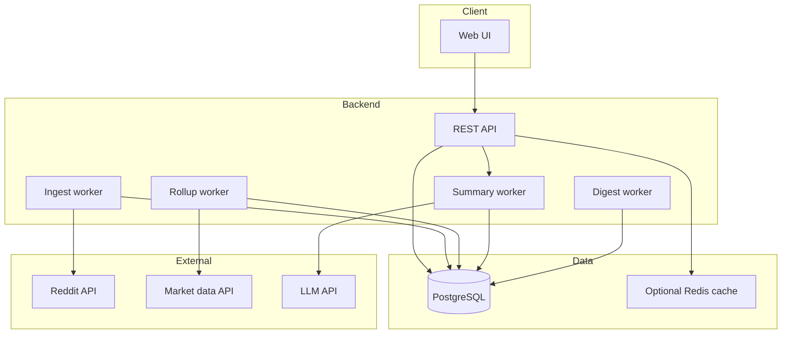

# Social Media Stock Picks — Design Document

**Version:** 0.1  
**Status:** Draft  
**Last updated:** 2026-05-16  
**Audience:** Personal use (single operator)

---

## 1. Overview

### 1.1 Purpose

Build a personal research tool that ingests discussion from selected Reddit communities focused on US equities, surfaces the most discussed and fastest-moving tickers over configurable time windows, summarizes narratives with a full LLM pipeline (with citations to source posts), and flags **watchlist-style** opportunity hypotheses by combining social signals with basic public market data.

### 1.2 Problem statement

Day and swing traders need a fast way to answer:

- What are people talking about right now (and over the last few days)?
- Is attention accelerating or fading?
- What is the bull/bear narrative without reading hundreds of comments?
- Are there setups where **social attention** and **price action** diverge in interesting ways?

Reddit is high-volume and noisy. Manual scanning does not scale.

### 1.3 Product principles

| Principle | Implication |
|-----------|-------------|
| Research aid, not advice | No buy/sell language; clear disclaimers on every summary and opportunity card |
| Source transparency | LLM output must cite Reddit post/comment IDs; user can open originals |
| Configurable, not fixed | Subreddits, time windows, ingest cadence, and summary scheduling are user-controlled |
| US equities only | Ticker normalization against a US symbol allowlist; no crypto |
| Personal tool | Single-user deployment; secrets in environment; no billing or multi-tenancy |
| No broker | No account linking, order placement, or portfolio sync (ever for v1) |

### 1.4 Explicit non-goals

- Automated trading or order routing
- Registered investment advice or personalized recommendations
- Crypto, forex, or international listings (v1)
- Multi-user SaaS, subscriptions, or public deployment requirements
- Broker / portfolio integrations

---

## 2. Users and use cases

### 2.1 Primary user

Single operator (developer-owner) running the stack locally or on private infrastructure.

### 2.2 Trader profiles (UI modes)

The application exposes two **ranking profiles** that reuse the same data but weight signals differently:

| Profile | Default window | Emphasis |
|---------|----------------|----------|
| **Day** | 24h (secondary: 4h) | Mention velocity, recent unique authors, opening-session buzz |
| **Swing** | 7d (compare prior 7d) | Sustained discussion, subreddit breadth, narrative shifts, DD depth |

Profiles affect default sorts and opportunity rule prioritization, not separate data pipelines.

### 2.3 Core use cases

| ID | Use case | Success criteria |
|----|----------|------------------|
| UC-1 | Morning scan | See top 20 tickers for last 24h in &lt; 30 seconds |
| UC-2 | Intraday check | Switch to 4h window; spot velocity leaders |
| UC-3 | Swing weekly review | 7d vs prior 7d comparison on a ticker (v2); narrative summary |
| UC-4 | Due diligence | Open ticker → read LLM summary → jump to cited threads |
| UC-5 | Watchlist ideas | Review opportunity cards; understand hypothesis and inputs |
| UC-6 | Offline digest | Read markdown/email digest generated on schedule |
| UC-7 | Configure sources | Enable/disable subreddits and ingest interval without code changes |

---

## 3. Data sources

### 3.1 Reddit (primary)

**Default subreddit pack** (all configurable):

| Subreddit | Day profile | Swing profile | Notes |
|-----------|-------------|---------------|-------|
| `wallstreetbets` | ✓ | ✓ | High volume, meme + momentum |
| `Daytrading` | ✓ | ✓ | Intraday focus |
| `stocks` | ✓ | ✓ | General equities |
| `StockMarket` | ✓ | ✓ | News and macro discussion |
| `options` | ✓ | ✓ | Derivatives context; optional weighting |
| `investing` | Optional | ✓ | Slower, longer-horizon |
| `SwingTrading` | — | Optional | Swing-specific |
| `pennystocks` | Off by default | Off by default | High spam; opt-in only |

**Ingestion:** Official Reddit API with OAuth. Store post/comment IDs and metadata; respect rate limits and content deletion on re-sync.

**Poll strategies per subreddit (configurable):** `new`, `hot`, `rising` — default `new` + `hot` on a schedule.

### 3.2 Market data (secondary)

Public market data API for **daily OHLCV** (minimum) and optionally intraday bars later. Used for:

- Price change overlays on dashboard and ticker pages
- Opportunity rules (e.g. social lead vs crowded move)

No broker connection. One provider configured via environment (e.g. Polygon, Alpaca data, Tiingo).

### 3.3 LLM provider

OpenAI, Anthropic, or compatible API for structured summarization. API key in environment only.

---

## 4. Functional design

### 4.1 Ingestion

- **Scheduled ingest:** Configurable interval (e.g. 5–60 minutes); can be disabled for manual-only mode.
- **Manual ingest:** User triggers full or incremental poll from UI or API.
- **Scope per run:** Fetch new/updated posts per subreddit sort; fetch comments up to configurable depth for high-engagement threads.
- **Idempotency:** Upsert by Reddit `fullname` ID; track `ingest_runs` for observability.

### 4.2 Ticker extraction and normalization

1. Extract cashtags and ticker-like tokens (`$AAPL`, `AAPL`, `BRK.B`).
2. Filter against **US equities allowlist** (NYSE/NASDAQ); refresh weekly from static file or provider.
3. Apply **false-positive blocklist** (`AI`, `ON`, `IT`, `DD` as ticker, etc.).
4. Record weighted mentions:

| Signal | Weight multiplier |
|--------|-------------------|
| Title mention | 2.0 |
| Post body | 1.5 |
| Comment | 1.0 |
| `DD` flair (if present) | 1.3 |
| Negative score post | 0.5 (optional) |

### 4.3 Aggregation and ranking

**Configurable time windows (defaults):** `1h`, `4h`, `24h`, `3d`, `7d`, `14d`, `30d`.

**Per-ticker rollup metrics:**

- Raw and weighted mention counts
- Unique authors
- Mention velocity (current window vs equal prior window)
- Engagement depth (comments per mentioning post)
- Subreddit breadth (count of distinct subs)
- Intent distribution (see §4.4)

**Ranking modes (user-selectable):**

- Most mentioned (weighted)
- Fastest rising (velocity)
- Highest engagement
- New this period (first appearance in window)

**Day vs swing profiles** apply default weights to the composite score (see SPEC for formulas).

### 4.4 Intent classification

Lightweight tags on posts (keyword rules in v1; optional LLM batch later):

`yolo`, `dd`, `earnings`, `technical`, `news`, `options`, `short_squeeze`, `unknown`

Used in summary prompts and opportunity rules (e.g. DD depth, options echo).

### 4.5 LLM summarization

**Trigger modes (configurable):**

- `on_demand` — when user opens ticker detail
- `scheduled` — pre-generate for top N tickers by rank
- `both`

**Input bundle (token-bounded):**

- Top posts by weighted score in window
- Top comments from those threads
- Rollup stats and intent mix
- Optional 5-day price/volume snippet

**Output:** Structured JSON (see SPEC §6) rendered in UI: bull/bear points, catalysts, risks, consensus, controversy, tone, citations.

**Guardrails:**

- Model must only assert claims supported by provided text
- Every substantive point linked to `post_id` or `comment_id`
- If mention count below threshold, return `insufficient_discussion` instead of inventing narrative
- Display disclaimer on all summary views

**Caching:** Keyed by `(ticker, window, content_version)`; invalidate when significant new posts arrive.

### 4.6 Opportunity signals (watchlist hypotheses)

Not trade recommendations. Each card includes: type, hypothesis, input metrics, confidence (low/medium), links to Reddit and chart.

| ID | Name | Day | Swing | Concept |
|----|------|-----|-------|---------|
| O1 | Social lead | ✓ | ✓ | High mention velocity; price relatively flat |
| O2 | Crowded move | ✓ | ✓ | Rising mentions + large recent price gain |
| O3 | Narrative flip | — | ✓ | Bullish intent share dropped vs prior window |
| O4 | Opening buzz | ✓ | — | Strong 4h mention spike + elevated early volume |
| O5 | DD depth | — | ✓ | Multiple DD posts, high engagement, muted price move |
| O6 | Options echo | ✓ | ✓ | Elevated `options` sub contribution (IV rank optional later) |

### 4.7 Digest

Optional scheduled job producing markdown (and optionally local email via user’s MTA):

- Top tickers for configured window
- New opportunity cards
- One-line summary per top ticker (from cache)

Default: weekday morning US/Eastern, user-configurable.

---

## 5. Information architecture (UI)

### 5.1 Screens

1. **Dashboard** — profile toggle (Day/Swing), window selector, top tickers table, opportunity strip, last ingest status, manual refresh.
2. **Ticker detail** — mention timeline, price chart, LLM summary with citations, top threads list, ticker-specific opportunities.
3. **Settings** — subreddits, ingest schedule, windows, LLM model, summary mode, digest, ranking weights (advanced).
4. **Digest view** — latest generated markdown.

### 5.2 Dashboard table columns

`Rank`, `Ticker`, `Mentions`, `Unique authors`, `Velocity`, `5d %`, `Tone` (from latest summary if cached), drill-down link.

### 5.3 Disclaimers

Persistent footer or banner: *"Aggregates public social discussion and market data for personal research. Not financial advice."*

---

## 6. System architecture

### 6.1 Recommended stack

| Layer | Technology |
|-------|------------|
| API | Python 3.12+, FastAPI |
| Jobs | APScheduler or Celery + Redis |
| Database | PostgreSQL 16+ |
| ORM / migrations | SQLAlchemy 2 + Alembic |
| Reddit | `asyncpraw` or OAuth2 + httpx |
| Frontend | Next.js or React (v1 can be API-only) |
| Deploy | Docker Compose on local machine |

### 6.2 Security (personal)

- Reddit and LLM credentials in `.env` (never committed)
- Optional HTTP basic auth or local-only bind (`127.0.0.1`)
- No PII beyond public Reddit usernames stored

---

## 7. Operational considerations

### 7.1 Reddit API limits

- Prefer posts + shallow comment fetch; deepen comments for top threads only
- Exponential backoff on 429; log failures per subreddit in `ingest_runs`

### 7.2 LLM cost control

- Cache summaries aggressively
- Scheduled generation limited to top N tickers
- Use smaller model for v1 (configurable)

### 7.3 Data retention

- Configurable raw post retention (e.g. 90 days)
- Rollups retained longer for historical comparison

### 7.4 Compliance posture

- Use official Reddit API; attribute sources
- No performance guarantees or investment solicitations in UI copy
- Operator responsible for own trading decisions

---

## 8. Roadmap

### 8.1 MVP (v0.1)

- [ ] Config-driven ingest for default subreddit pack
- [ ] US ticker extraction and rollups (`4h`, `24h`, `7d`)
- [ ] Dashboard API + minimal UI
- [ ] Ticker detail with top threads
- [ ] Daily market bars overlay
- [ ] LLM summaries with citations
- [ ] Six opportunity types + day/swing profiles
- [ ] Markdown digest job

### 8.2 v0.2

- [ ] Window-over-window comparison on dashboard
- [ ] Co-mention graph (ticker A often mentioned with B)
- [ ] Advanced ranking weight sliders
- [ ] Spam / low-quality author heuristics

### 8.3 Out of scope (indefinite)

- Broker integration
- Automated order execution
- Multi-tenant hosting

---

## 9. Open questions

| # | Question | Default assumption |
|---|----------|-------------------|
| Q1 | Market data provider for MVP? | Tiingo or Polygon free tier |
| Q2 | Frontend v0: full Next.js vs API-only? | Minimal React dashboard |
| Q3 | Comment depth default? | 2 levels on posts with score &gt; threshold |
| Q4 | Minimum mentions for LLM summary? | 5 weighted mentions in window |

---

## 10. Glossary

| Term | Definition |
|------|------------|
| Mention | Single extracted ticker reference in a post or comment |
| Velocity | Relative change in mentions vs prior equal-length window |
| Opportunity | Heuristic watchlist card, not a trade signal |
| Profile | Day or Swing UI/ranking preset |
| Window | Rolling time period for aggregation (e.g. `24h`) |

---

## Appendix A — Default configuration

See `docs/SPEC.md` §3 for the authoritative `config.yaml` schema and default values.
